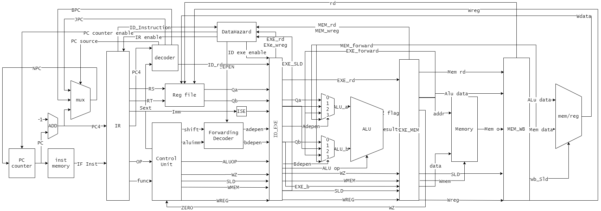
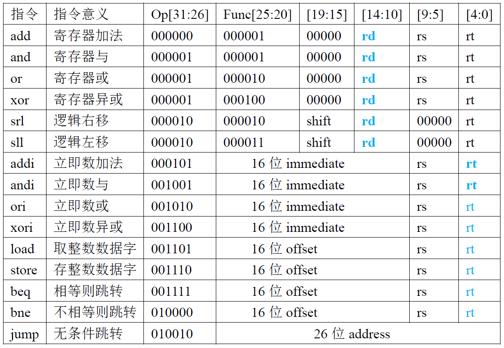

五级流水线CPU

计算机系统结构实验

1. 看懂给定的单周期CPU代码并分析运行过程
2. 给CPU添加流水段寄存器以实现五级流水线CPU
3. 利用内部前推(Frowarding)解决普通数据冒险；用内部前推+流水线暂停解决load指令的数据冒险
4. 解决jmp,bne,beq的控制冒险问题

个人太垃圾+每天咕咕咕导致只做了前三个，最后一个肝不动了

下面是电路图+支持的指令集

电路图




支持的指令




测试用的指令序列为:

```
add   r1, r2, r3;
and   r4, r1, r5;
or    r6, r7, r1;
addi  r8, r1, 0x000a;	
load  r1, 0xfff5(r8);
sll   r9, r1, 0x02;
store r9, 0x0027(r1);
```

仿真测试通过，解决全部数据冒险。
